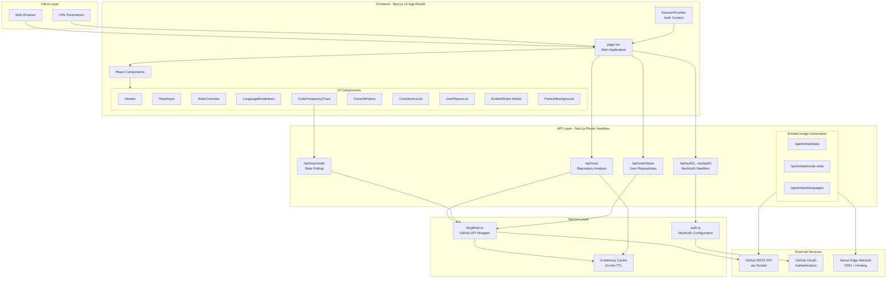
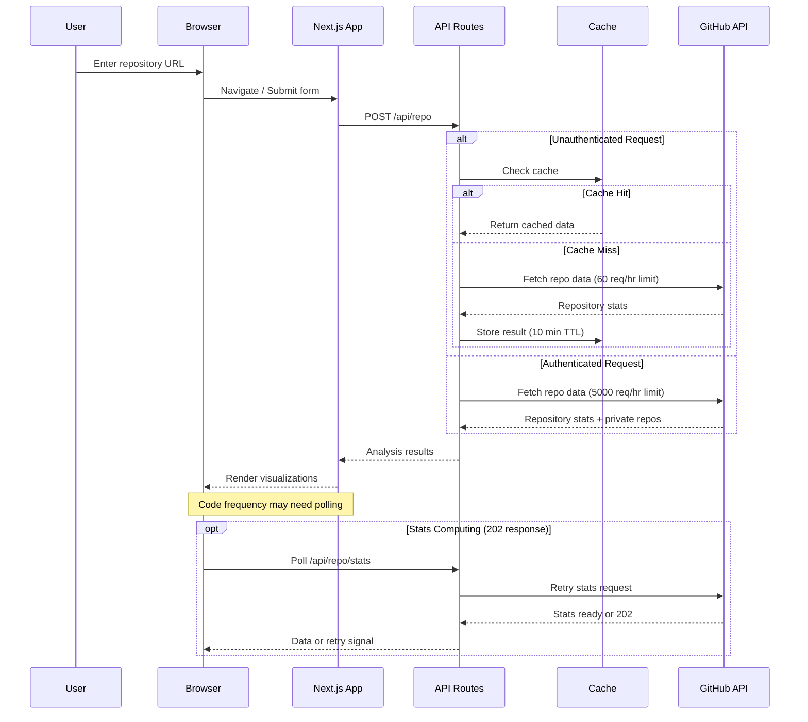

# Architecture Overview

## System Architecture Diagram

## Data Flow Diagram

## Key Architectural Decisions

### 1. Next.js 15 App Router with Server Components

I chose Next.js 15's App Router because it provides the best developer experience for a React application that needs both client-side interactivity and server-side data fetching. The App Router allows me to:

- Use React Server Components for the layout and initial data loading
- Leverage route handlers for API endpoints without a separate backend
- Take advantage of built-in optimizations like automatic code splitting
- Use the new Turbopack for faster development builds

### 2. Edge Runtime for Embed Image Generation

The embed routes (`/api/embed/*`) use the Edge runtime with `next/og` (Satori) for SVG-to-image generation. I made this choice because:

- Edge functions have lower cold start times than serverless functions
- Image generation needs to be fast for README embeds
- CDN caching at the edge reduces API calls significantly
- The 1-hour cache (`s-maxage=3600`) balances freshness with performance

### 3. In-Memory Server-Side Caching

For unauthenticated requests, I implemented a simple in-memory cache with a 10-minute TTL. This decision was made because:

- GitHub's unauthenticated rate limit is only 60 requests per hour
- Popular repositories would quickly exhaust the limit without caching
- Memory cache is simpler than Redis for a single-instance deployment
- The cache has a max size limit (100 entries) to prevent memory issues

### 4. Client-Side Authentication State with NextAuth v5

I use NextAuth v5 (Auth.js) with the GitHub provider for authentication. The access token is stored in the JWT and passed to the client session. Key reasons:

- No database required - tokens exist only in signed JWTs
- Privacy-first approach - no credentials stored server-side
- The `repo` scope allows access to private repositories
- Session data is available on both client and server

### 5. Parallel Data Fetching

In `lib/github.ts`, I fetch repository data, languages, commits, code frequency, and contributors in parallel using `Promise.all()`. This significantly reduces total request time compared to sequential fetching, though it increases API usage per request.

### 6. Progressive Enhancement for Statistics

GitHub's statistics API returns 202 when stats are still being computed. Rather than blocking the UI, I:

- Return empty data immediately and render placeholders
- Poll with exponential backoff (3s, 6s, 12s, 24s, 48s) on the client
- Use a fallback endpoint for contributors if stats aren't ready
- Show clear loading states with helpful messaging

### 7. URL-Based State Management

Repository selection is reflected in the URL (`?repo=owner/repo`). This enables:

- Shareable links to specific repository analyses
- Browser history navigation
- Bookmarkable results
- SEO benefits for public repository pages

### 8. Component-Based Visualization Architecture

Each visualization (stats, languages, commits, frequency, contributors) is a self-contained component that receives the full analysis data and extracts what it needs. This makes components reusable and testable, though it does mean passing more data than strictly necessary.
